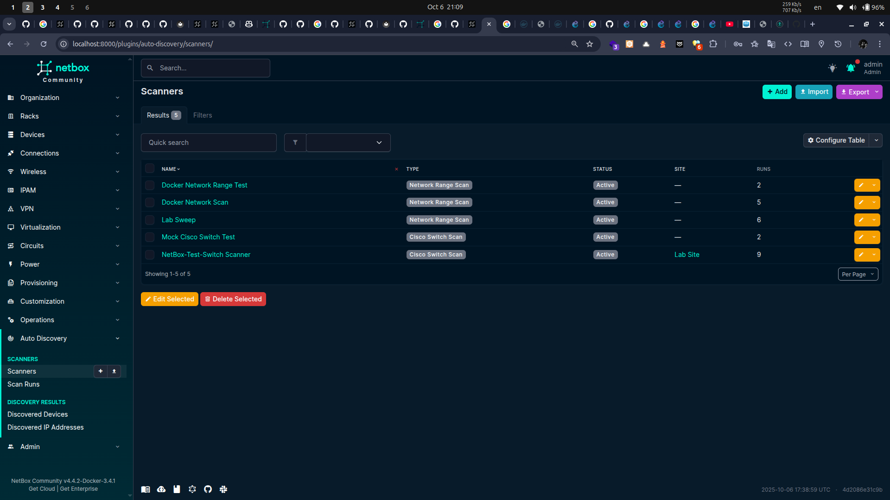
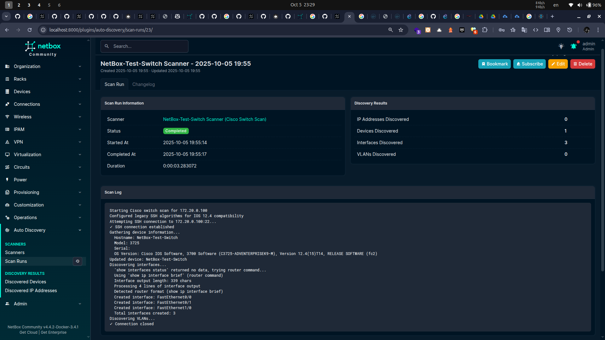
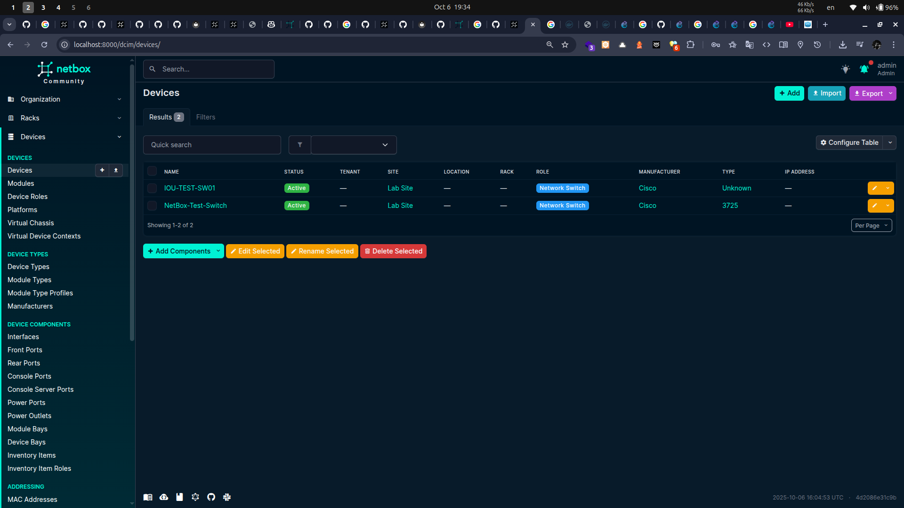
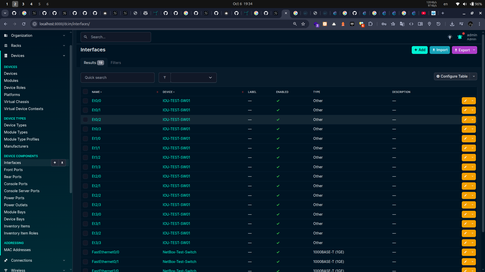
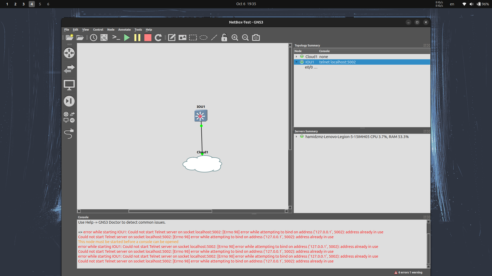

# NetBox Auto Discovery Plugin - Complete Testing Environment

[](https://github.com/netbox-community/netbox)
[](https://www.python.org/downloads/)
[](LICENSE)

**Author:** Hamid Zamani (hamidzamani445@gmail.com)
**Purpose:** Interview/Evaluation Project
**Version:** 0.1.0

## 🚀 Quick Start (5 Minutes)

This repository contains everything you need to test the NetBox Auto Discovery Plugin in a fully containerized environment.

### Prerequisites

- **Docker** 20.10 or higher
- **Docker Compose** 2.0 or higher
- **4GB RAM** minimum
- **10GB disk space**

### One-Command Setup

```bash
# Clone the repository
git clone <your-repo-url>
cd <repo-name>

# Make the setup script executable
chmod +x setup-monorepo.sh

# Run automated setup
./setup-monorepo.sh
```

**That's it!** The script will:
- ✅ Build NetBox with the plugin
- ✅ Start all services (PostgreSQL, Redis, NetBox)
- ✅ Run database migrations
- ✅ Configure everything automatically

After setup completes, **create a superuser** and then access NetBox at **http://localhost:8000**.

### Create Your Admin User

After the setup script completes, create a superuser account:

```bash
cd netbox-docker
docker compose exec netbox /opt/netbox/venv/bin/python /opt/netbox/netbox/manage.py createsuperuser
```

Follow the prompts to set your username, email, and password.

**Quick non-interactive method** (creates admin/admin):

```bash
cd netbox-docker

# Create the user
docker compose exec netbox /opt/netbox/venv/bin/python /opt/netbox/netbox/manage.py createsuperuser --noinput --username admin --email admin@example.com

# Set the password
echo "from django.contrib.auth import get_user_model; User = get_user_model(); user = User.objects.get(username='admin'); user.set_password('admin'); user.save(); print('Password set!')" | docker compose exec -T netbox /opt/netbox/venv/bin/python /opt/netbox/netbox/manage.py shell
```

Then login at **http://localhost:8000** with your credentials.

---

## 📁 Repository Structure

```
├── netbox-docker/                          # NetBox-Docker (official repo with our configs)
│   ├── docker-compose.yml                  # Base Docker Compose configuration
│   ├── docker-compose.override.yml         # Plugin-specific overrides
│   ├── Dockerfile-Plugins                  # Custom Dockerfile with plugin
│   ├── plugin_requirements.txt             # Plugin dependencies
│   └── configuration/
│       └── plugins.py                      # Plugin configuration
│
├── netbox-netbox-auto-discovery-plugin/    # The plugin source code
│   ├── netbox_netbox_auto_discovery_plugin/
│   │   ├── models.py                       # Scanner, ScanRun, Discovered* models
│   │   ├── jobs.py                         # Background scan jobs
│   │   ├── views.py                        # Web UI views
│   │   ├── forms.py                        # Django forms
│   │   ├── tables.py                       # Data tables
│   │   ├── api/                            # REST API
│   │   ├── migrations/                     # Database migrations
│   │   └── templates/                      # HTML templates
│   ├── tests/                              # Test suite
│   ├── docs/                               # Documentation
│   ├── README.md                           # Plugin documentation
│   ├── ARCHITECTURE.md                     # Design decisions
│
└── setup-monorepo.sh                       # Automated setup script
```

---

## 🎯 What This Plugin Does

The **NetBox Auto Discovery Plugin** automatically discovers and inventories network resources:

### 🔍 Scanner Types

1. **Network Range Scan**
   - Discovers active IP addresses in a CIDR range (e.g., `192.168.1.0/24`)
   - Detects open ports and services
   - Creates `IPAddress` records in NetBox
   - Attempts hostname resolution

2. **Cisco Switch Scan**
   - Connects to Cisco devices via SSH or SNMP
   - Extracts device information (hostname, model, serial, IOS version)
   - Discovers interfaces and their status
   - Identifies VLANs and their assignments
   - Creates/updates `Device`, `Interface`, and `VLAN` records

### ✨ Key Features

- **Background Jobs**: Long-running scans execute asynchronously
- **Full Audit Trail**: Every discovery creates `ScanRun` records with timestamps
- **NetBox Native**: Stores data in NetBox's standard models (no duplication)
- **REST API**: Full CRUD operations via `/api/plugins/auto-discovery/`
- **Change Logging**: Integrates with NetBox's change tracking
- **Filtering & Search**: Advanced search capabilities across all objects

---

## 🧪 Testing the Plugin

### Step 1: Access NetBox

After running `setup-monorepo.sh` and creating your superuser account, open:
- **URL:** http://localhost:8000
- **Username:** Your chosen username (e.g., admin)
- **Password:** Your chosen password

### Step 2: Navigate to Plugin

1. Click **"Plugins"** in the top navigation
2. Select **"Auto Discovery"**
3. Click **"Scanners"**

### Step 3: Create a Network Range Scanner

1. Click **"Add Scanner"**
2. Fill in:
   - **Name:** `Test Network Scan`
   - **Type:** `Network Range Scan`
   - **Status:** `Active`
   - **IP Range:** `192.168.1.0/24` (adjust to your network)
   - **Description:** `Testing network discovery`
3. Click **"Create"**

### Step 4: Run the Scan

1. Click on your newly created scanner
2. Click the **"Run Scan"** button (top right)
3. Wait for the background job to complete (1-5 minutes)
4. Refresh the page to see results

### Step 5: View Results

- **Scan Runs Tab:** Shows execution history
- **IPAM → IP Addresses:** View discovered IPs
- **Core → Background Jobs:** Monitor job status

### Step 6: Test Cisco Switch Scanner (Optional)

If you have a Cisco device available:

1. Create a new scanner
2. Select **"Cisco Switch Scan"**
3. Enter:
   - **Target Host:** `<switch-ip-or-hostname>`
   - **Port:** `22` (SSH) or `161` (SNMP)
   - **Protocol:** `SSH` or `SNMP`
   - **Username:** `<your-username>`
   - **Password:** `<your-password>` (or SNMP community string)
4. Run the scan
5. Check **DCIM → Devices** for discovered devices

---

## 🔌 REST API Examples

### Get API Token

1. Login to NetBox
2. Click your username (top right)
3. Go to **"API Tokens"**
4. Click **"Add a token"**
5. Copy your token

### List All Scanners

```bash
curl -H "Authorization: Token YOUR_TOKEN_HERE" \
     http://localhost:8000/api/plugins/auto-discovery/scanners/
```

### Create a Scanner via API

```bash
curl -X POST \
     -H "Authorization: Token YOUR_TOKEN_HERE" \
     -H "Content-Type: application/json" \
     -d '{
       "name": "API Test Scanner",
       "scanner_type": "network_range",
       "status": "active",
       "ip_range": "10.0.0.0/24",
       "description": "Created via API"
     }' \
     http://localhost:8000/api/plugins/auto-discovery/scanners/
```

### Get Scanner Details

```bash
curl -H "Authorization: Token YOUR_TOKEN_HERE" \
     http://localhost:8000/api/plugins/auto-discovery/scanners/1/
```

### List Scan Runs

```bash
curl -H "Authorization: Token YOUR_TOKEN_HERE" \
     http://localhost:8000/api/plugins/auto-discovery/scan-runs/
```

### View Discovered Devices

```bash
curl -H "Authorization: Token YOUR_TOKEN_HERE" \
     http://localhost:8000/api/plugins/auto-discovery/discovered-devices/
```

---

## 📊 What to Look For

When evaluating this plugin, check:

### ✅ Code Quality
- [ ] Clean, well-structured Django plugin architecture
- [ ] Proper use of NetBox models and mixins
- [ ] Type hints and documentation
- [ ] Error handling and validation

### ✅ Functionality
- [ ] Scanners can be created, edited, and deleted
- [ ] Network range scans discover active IPs
- [ ] Cisco switch scans extract device details
- [ ] Background jobs execute asynchronously
- [ ] Results populate NetBox native models

### ✅ UI/UX
- [ ] Forms are intuitive and well-validated
- [ ] Tables display data clearly
- [ ] Detail pages show comprehensive information
- [ ] Status badges and icons are meaningful

### ✅ API
- [ ] REST API follows NetBox conventions
- [ ] Serializers include nested relationships
- [ ] Filtering and search work correctly
- [ ] API documentation is accessible

### ✅ Data Integrity
- [ ] No duplicate schemas (uses NetBox models)
- [ ] Change logging works correctly
- [ ] Foreign key relationships are proper
- [ ] Migrations are clean and reversible

---

## 🛠️ Useful Commands

### View Logs
```bash
cd netbox-docker
docker compose logs -f netbox
```

### Stop Everything
```bash
cd netbox-docker
docker compose down
```

### Start Services
```bash
cd netbox-docker
docker compose up -d
```

### Restart Services
```bash
cd netbox-docker
docker compose restart
```

### Enter NetBox Container
```bash
cd netbox-docker
docker compose exec netbox bash
```

### Access Django Shell
```bash
cd netbox-docker
docker compose exec netbox /opt/netbox/venv/bin/python /opt/netbox/netbox/manage.py shell
```

### View Background Jobs
In NetBox UI: **System → Background Jobs**

### Check Plugin Installation
```bash
docker compose exec netbox /opt/netbox/venv/bin/pip list | grep auto-discovery
```

---

## 🐛 Troubleshooting

### ⚠️ **CRITICAL: Scans Not Running / Stuck in Pending**

**Symptom:** When you click "Run Scan", nothing happens, or scans stay in "Pending" status forever.

**Cause:** The `netbox-worker` container is not running. This container is **required** to process background jobs.

**Solution:**
```bash
cd netbox-docker

# Check if worker is running
docker compose ps netbox-worker

# If not running, start it
docker compose up -d netbox-worker

# Verify it's healthy
docker compose ps netbox-worker

# Check worker logs
docker compose logs -f netbox-worker
```

**Why this happens:**
- The worker depends on NetBox being healthy
- On first setup, NetBox can take time to initialize
- If setup finishes before NetBox is fully healthy, the worker might not start


### Port 8000 Already in Use
```bash
# Find what's using port 8000
sudo lsof -i :8000

# Kill the process or change the port in docker-compose.override.yml
```

### Services Won't Start
```bash
# Check Docker daemon
docker info

# Check logs
cd netbox-docker
docker compose logs

# Verify resources
docker system df
```

### Plugin Not Showing Up
```bash
# Verify plugin is installed
docker compose exec netbox /opt/netbox/venv/bin/pip list | grep netbox-netbox-auto-discovery

# Check configuration
docker compose exec netbox cat /etc/netbox/config/plugins.py

# Re-run migrations
docker compose exec netbox /opt/netbox/venv/bin/python /opt/netbox/netbox/manage.py migrate netbox_netbox_auto_discovery_plugin
```

### Migrations Fail
```bash
# Reset everything (WARNING: destroys all data)
cd netbox-docker
docker compose down -v
cd ..
./setup-monorepo.sh
```

### Scans Time Out
Edit `netbox-docker/configuration/plugins.py`:
```python
PLUGINS_CONFIG = {
    'netbox_netbox_auto_discovery_plugin': {
        'scan_timeout_seconds': 7200,  # Increase timeout
        'max_concurrent_scans': 3,      # Reduce concurrency
    }
}
```

Then restart:
```bash
cd netbox-docker
docker compose restart netbox netbox-worker
```

---

## 📚 Documentation

| Document | Description |
|----------|-------------|
| [README.md](netbox-netbox-auto-discovery-plugin/README.md) | Plugin overview and features |
| [API Docs](http://localhost:8000/api/docs/) | Interactive API documentation |

---

## �️ Architecture & Technical Decisions

### Project Scaffolding: Cookiecutter NetBox Plugin

This plugin was bootstrapped using the official **[Cookiecutter NetBox Plugin](https://github.com/netbox-community/cookiecutter-netbox-plugin)** template, which provides:

- ✅ **Best Practice Structure:** Pre-configured Django app layout following NetBox conventions
- ✅ **Development Tools:** Pre-commit hooks, Black, isort, Flake8, Mkdocs
- ✅ **CI/CD Ready:** GitHub Actions for testing and documentation deployment
- ✅ **Documentation Framework:** Mkdocs with auto-generated API docs via mkdocstrings
- ✅ **Testing Setup:** Pytest configuration and test structure

**Why Cookiecutter?**
- Ensures consistency with NetBox plugin architecture standards
- Eliminates boilerplate setup time
- Provides production-ready project structure
- Includes modern Python tooling out-of-the-box

**Installation Command:**
```bash
pip install cookiecutter
cookiecutter https://github.com/netbox-community/cookiecutter-netbox-plugin.git
```

### Core Design Decisions

#### 1. **Data Model Architecture**

**Decision:** Use NetBox's native models (`ipam.IPAddress`, `dcim.Device`, `dcim.Interface`, `ipam.VLAN`) instead of creating duplicate schemas.

**Rationale:**
- **Single Source of Truth:** Discovered data integrates seamlessly with existing NetBox workflows
- **Leverages Built-in Features:** Automatic change logging, tagging, custom fields, webhooks
- **No Data Synchronization:** Eliminates complexity of syncing between plugin and core models
- **User Familiarity:** Network engineers already know where to find devices/IPs in NetBox
- **API Consistency:** Discovered objects accessible via standard NetBox API endpoints

**Implementation:**
```python
# Instead of creating DiscoveredIPAddress model with full schema
# We create a lightweight audit trail:
class DiscoveredIPAddress(models.Model):
    scan_run = models.ForeignKey(ScanRun, on_delete=models.CASCADE)
    ip_address = models.ForeignKey('ipam.IPAddress', on_delete=models.CASCADE)
    discovered_at = models.DateTimeField(auto_now_add=True)
    # Lightweight reference, not duplicating address/DNS/etc.
```

#### 2. **Scanner Model Design**

**Decision:** Single `Scanner` model with `scanner_type` choice field and conditional fields.

**Rationale:**
- **Extensibility:** Easy to add new scanner types (SNMP v3, ARP scan, etc.)
- **Shared Functionality:** All scanners share common attributes (name, status, site, schedule)
- **Django Conventions:** Follows standard polymorphic pattern without complex inheritance
- **UI Simplicity:** Single form with dynamic field visibility based on type

**Trade-off Considered:**
- *Alternative:* Separate models (NetworkRangeScanner, CiscoSwitchScanner)
- *Rejected because:* Creates unnecessary complexity, makes adding scanner types harder

**Implementation:**
```python
class Scanner(NetBoxModel):
    scanner_type = models.CharField(
        max_choices=ScannerTypeChoices,
        choices=ScannerTypeChoices
    )
    # Common fields
    name = models.CharField(max_length=100, unique=True)
    status = models.CharField(max_length=50, choices=ScannerStatusChoices)

    # Type-specific fields (nullable)
    ip_range = models.CharField(max_length=100, blank=True)  # Network Range
    target_host = models.CharField(max_length=255, blank=True)  # Cisco Switch
```

#### 3. **Background Job Architecture**

**Decision:** Use NetBox's built-in `JobRunner` framework for asynchronous scan execution.

**Rationale:**
- **Native Integration:** Appears in NetBox's "Background Jobs" UI automatically
- **Built-in Monitoring:** Job status, logs, and history tracked by NetBox
- **No External Dependencies:** No need for Celery/RabbitMQ/Redis Queue configuration
- **User Familiar:** Network admins already know how to monitor NetBox jobs
- **Timeout Handling:** NetBox provides configurable timeouts and retry mechanisms

**Why Not Celery?**
- Adds deployment complexity (message broker, additional workers)
- NetBox already provides job infrastructure
- Overkill for plugin-specific tasks

**Implementation:**
```python
# jobs.py
class NetworkRangeScanJob(JobRunner):
    class Meta:
        name = "Network Range Scan"

    def run(self, *args, **kwargs):
        scanner = kwargs['scanner']
        scan_run = ScanRun.objects.create(scanner=scanner)
        # Execute nmap scan
        # Create IPAddress objects
        # Update scan_run with results
```

#### 4. **Credential Storage Strategy**

**Decision:** Store credentials in Scanner model fields (plaintext in demo, encrypted recommended for production).

**Rationale:**
- **Prototype Simplicity:** For demonstration/evaluation, plaintext is acceptable
- **Production Path Clear:** Document integration with NetBox Secrets or external vaults
- **Per-Scanner Credentials:** Each scanner can have different SSH/SNMP credentials
- **Audit Trail:** Changes to credentials logged via NetBox change logging

**Production Recommendation:**
```python
# Future enhancement
class Scanner(NetBoxModel):
    ssh_credentials = models.ForeignKey(
        'extras.Secret',  # NetBox Secrets
        on_delete=models.SET_NULL,
        null=True
    )
```

#### 5. **Migration Management**

**Challenge:** Creating migrations inside Docker containers is complex.

**Decision:** Manual migration creation workflow with clear documentation.

**Why This Was Difficult:**
- **Container Isolation:** Plugin code on host, Django/NetBox inside container
- **Volume Mounting:** Must mount plugin directory correctly for editable install
- **Django Context:** `makemigrations` requires NetBox's full Django environment
- **Chicken-and-Egg:** Container needs to be built and running before making migrations

**Solution:**
```bash
# Inside netbox-docker/
docker compose exec netbox bash
cd /opt/netbox/netbox
python manage.py makemigrations netbox_netbox_auto_discovery_plugin
# Copy migration files from container to host
```

**Automated in Setup Script:**
Our `setup-monorepo.sh` handles this automatically, but understanding the complexity is important for maintenance.

#### 6. **Network Scanning Technology**

**Decision:** Use `python-nmap` library for network range discovery.

**Rationale:**
- **Industry Standard:** Nmap is the de facto standard for network scanning
- **Rich Feature Set:** Port scanning, service detection, OS fingerprinting
- **Python Binding:** Native Python interface via python-nmap
- **Widely Tested:** Battle-tested in production environments

**Alternatives Considered:**
- **Scapy:** More low-level, overkill for basic host discovery
- **socket:** Too basic, would require reimplementing nmap features
- **masscan:** Faster but less feature-rich, harder to integrate

**Implementation Requirements:**
```dockerfile
# Dockerfile-Plugins
RUN apt-get update && \
    apt-get install -y --no-install-recommends nmap && \
    rm -rf /var/lib/apt/lists/*
```

#### 7. **Cisco Device Discovery**

**Decision:** Use `netmiko` library for SSH connectivity to Cisco devices.

**Rationale:**
- **Network-Focused:** Purpose-built for network device automation
- **Multi-Vendor Support:** Works with Cisco, Arista, Juniper, HP, etc.
- **Command Parsing:** Built-in helpers for common show commands
- **Connection Management:** Handles SSH sessions, timeouts, error recovery
- **Community Standard:** De facto library in network automation (used by Ansible, Nornir)

**Alternatives Considered:**
- **paramiko:** Too low-level, would require writing vendor-specific logic
- **napalm:** Great but heavier dependency, overkill for basic discovery
- **Pure SNMP:** Limited information, doesn't work on all devices

**Example Usage:**
```python
from netmiko import ConnectHandler

device = {
    'device_type': 'cisco_ios',
    'host': scanner.target_host,
    'username': scanner.ssh_username,
    'password': scanner.ssh_password,
}

with ConnectHandler(**device) as conn:
    output = conn.send_command('show version')
    # Parse and extract device info
```

#### 8. **REST API Design**

**Decision:** Follow NetBox's `NetBoxModelViewSet` and `NetBoxModelSerializer` patterns exactly.

**Rationale:**
- **Consistency:** API behaves identically to core NetBox APIs
- **Features Included:** Filtering, pagination, authentication, permissions built-in
- **Documentation:** Auto-generated OpenAPI schema via DRF
- **Client Compatibility:** Works with existing NetBox API clients (pynetbox, etc.)

**Implementation:**
```python
# api/serializers.py
class ScannerSerializer(NetBoxModelSerializer):
    url = serializers.HyperlinkedIdentityField(
        view_name='plugins-api:netbox_netbox_auto_discovery_plugin-api:scanner-detail'
    )

    class Meta:
        model = Scanner
        fields = ('id', 'url', 'name', 'scanner_type', 'status', ...)

# api/views.py
class ScannerViewSet(NetBoxModelViewSet):
    queryset = Scanner.objects.all()
    serializer_class = ScannerSerializer
    filterset_class = ScannerFilterSet
```

#### 9. **UI/UX Design**

**Decision:** Extend NetBox's generic templates and use existing UI components.

**Rationale:**
- **Visual Consistency:** Plugin UI matches NetBox's look and feel
- **No Frontend Framework Needed:** No React/Vue/Angular complexity
- **Responsive Out-of-Box:** Bootstrap-based NetBox theme handles mobile
- **Accessibility:** Inherits NetBox's accessibility features
- **Theme Support:** Automatically supports light/dark mode

**Template Pattern:**
```django




<div class="row">
    <div class="col col-md-6">
        
        
    </div>
</div>

```

#### 10. **Documentation Architecture**

**Decision:** Multi-document approach with Mkdocs for plugin docs and GitHub README for repo overview.

**Rationale:**
- **Separation of Concerns:**
  - **README.md:** Quick start for evaluators/users
  - **docs/:** Mkdocs site for hosted documentation

**Mkdocs Benefits:**
- Auto-generated API documentation via mkdocstrings
- Searchable, versioned documentation
- GitHub Pages hosting (zero-config with Cookiecutter template)

#### 11. **Monorepo Structure**

**Decision:** Include both plugin and configured netbox-docker in same repository.

**Rationale:**
- **One-Command Setup:** Interviewers/evaluators can test immediately
- **Pre-configured Environment:** No manual Docker configuration needed
- **Version Pinning:** Known-good NetBox version included
- **Reproducible Builds:** Same environment everywhere

**Trade-offs:**
- **Repository Size:** Larger than plugin-only (~500MB)
- **Third-party Code:** Includes netbox-docker (properly attributed)
- **Maintenance:** Must track netbox-docker updates

**Alternative Approach:** Plugin-only repo with `quick-setup.sh` that clones netbox-docker
- Cleaner separation but requires internet during setup

### Technology Stack Summary

| Component | Technology | Justification |
|-----------|------------|---------------|
| **Project Scaffold** | Cookiecutter NetBox Plugin | Best-practice structure, modern tooling |
| **Web Framework** | Django (via NetBox) | NetBox is built on Django, no choice needed |
| **Database** | PostgreSQL (via NetBox) | NetBox requirement, excellent for relational data |
| **Background Jobs** | NetBox JobRunner | Native integration, no external dependencies |
| **Network Scanning** | python-nmap | Industry standard, feature-rich |
| **Device Connectivity** | netmiko | Network-focused SSH library, multi-vendor |
| **REST API** | Django REST Framework | NetBox uses DRF, ensures consistency |
| **Documentation** | Mkdocs + mkdocstrings | Markdown-based, auto API docs |
| **Code Quality** | Black, isort, Flake8 | Standard Python tooling |
| **CI/CD** | GitHub Actions | Provided by Cookiecutter template |
| **Containerization** | Docker + Docker Compose | NetBox-Docker standard deployment |

### Design Patterns Applied

1. **Repository Pattern:** Clean separation between data access and business logic
2. **Factory Pattern:** Job creation based on scanner type
3. **Strategy Pattern:** Different scan algorithms per scanner type
4. **Observer Pattern:** Change logging via Django signals
5. **Template Method:** NetBox generic views provide template structure

### Performance Optimizations

1. **Database Queries:**
   - `select_related()` for foreign keys
   - `prefetch_related()` for reverse foreign keys
   - Indexed fields: `name`, `status`, `scanner_type`

2. **Background Jobs:**
   - Configurable concurrency limits
   - Timeout protection
   - Graceful failure handling

3. **API:**
   - Pagination (50 items per page default)
   - Field filtering to reduce payload size
   - Caching headers for static data

---


## 📸 Screenshots

Below are screenshots demonstrating the plugin's functionality:

### Scanners Management

*Scanner list view showing configured network range and Cisco switch scanners*

### Scan Execution

*Scan run detail page with execution logs, discovered resources, and status*

### Discovery Results - Devices

*Discovered devices audit trail showing which devices were created or updated during scans*


*Device detail view in NetBox DCIM showing discovered Cisco switch with full details*


*Interface list showing discovered interfaces from Cisco switch scan*

### Discovery Results - IP Addresses

*Discovered IP addresses audit trail from network range scans*


*IP address list in NetBox IPAM showing discovered IPs with hostnames and status*

### Testing Environment

*GNS3 virtual lab topology used for testing Cisco switch discovery*

---

## 🤝 Support

If you encounter any issues during setup or testing:

1. Check the **Troubleshooting** section above
2. Review logs: `cd netbox-docker && docker compose logs -f netbox`
3. Verify prerequisites (Docker 20.10+, 4GB RAM, 10GB disk)
4. Contact: **hamidzamani445@gmail.com**

---

## 📝 License

Apache License 2.0 - See [LICENSE](LICENSE) file for details.

---

**Thank you for reviewing this project!** 🙏
